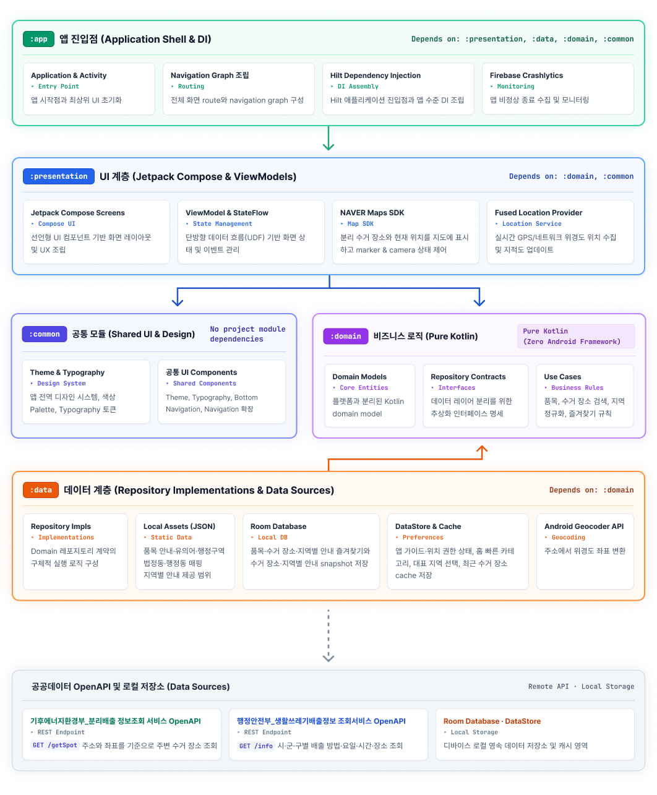

<p align="center">
  
</p>

<h1 align="center">여기버려</h1>

<p align="center">
  품목과 위치를 기준으로 분리배출 방법과 주변 수거 장소를 안내하는 Android 앱
</p>

<p align="center">
  <a href="https://github.com/AndroidStudy-Sesac/Yeogi-Beoryeo/actions/workflows/android-ci.yml">
    
  </a>
  
  
</p>

## 프로젝트 소개

여기버려는 사용자가 버리려는 품목과 현재 지역을 기준으로 다음 정보를 안내합니다.

- 품목별 분리배출 방법과 유의사항
- 현재 위치 주변의 소형가전 수거 장소
- 지역별 생활폐기물 배출 요일·시간·장소
- 품목·수거 장소·지역별 안내 즐겨찾기

공공데이터 OpenAPI와 앱에 포함된 가공 데이터를 함께 사용합니다. 정부기관이 제작하거나 운영하는 공식 앱은 아닙니다.

현재 Google Play에서 비공개 테스트를 진행하고 있습니다.

## 주요 기능

### 품목 검색과 분리배출 안내

- 품목명과 유의어를 이용한 검색
- 품목별 배출 방법과 주의사항 제공
- 자주 확인하는 품목 즐겨찾기
- 홈 화면 빠른 카테고리 설정

### 주변 수거 장소 지도

- 현재 위치와 지역 검색을 이용한 장소 조회
- NAVER 지도 기반 수거 장소 표시
- 다수의 검색 결과를 marker clustering으로 표현
- 수거 장소 상세 정보와 즐겨찾기 제공

### 지역별 배출 안내

- 시·군·구별 배출 요일·시간·장소 안내
- 행정동·법정동·지역 별칭을 고려한 지역 탐색
- 대표 지역 고정과 즐겨찾기 제공

### 사용성과 접근성

- 검색·지도·안내 화면의 상태 복원
- 첫 실행 앱 사용 가이드와 설정 화면 재실행
- 큰 글자, 가로 화면, 짧은 화면 높이를 고려한 UI
- loading·empty·error 상태를 구분한 화면 구성

## Architecture

각 모듈의 `Depends on`은 compile dependency를 나타냅니다. 화살표는 주요 구성·연결 흐름을, 점선은 runtime 데이터 소스 접근 관계를 나타냅니다.

<p align="center">
  
</p>

### 모듈 구성

| 모듈 | 책임 |
|---|---|
| `app` | 앱 진입점, navigation, DI 조립, 외부 SDK 초기화 |
| `presentation` | Jetpack Compose UI, ViewModel, 화면 상태 관리 |
| `domain` | model, repository 계약, use case, business logic |
| `data` | API·Local Asset·Room·DataStore 접근과 repository 구현 |
| `common` | theme과 공통 UI 구성요소 |

## 데이터와 외부 서비스

### 공공데이터 OpenAPI

| API | 사용 목적 | 호출 endpoint |
|---|---|---|
| [기후에너지환경부_분리배출 정보조회 서비스](https://www.data.go.kr/data/15156866/openapi.do) | 현재 위치와 주소를 기준으로 주변 수거 장소 조회 | `GET /1482000/WasteRecyclingService/getSpot` |
| [행정안전부_생활쓰레기배출정보 조회서비스](https://www.data.go.kr/data/15155080/openapi.do) | 시·군·구별 생활폐기물 배출 방법·요일·시간·장소 조회 | `GET /1741000/household_waste_info/info` |

### 가공 Local Asset

실시간 API만으로 안정적으로 제공하기 어려운 정보는 검증과 가공을 거쳐 앱 asset으로 관리합니다.

- 품목별 분리배출 안내
- 대표 품목 상세 정보
- 검색 유의어
- 행정구역 정보
- 법정동과 행정동 매핑
- 지역별 안내 제공 범위

상세 출처와 가공 기준은 [DATA_SOURCES.md](DATA_SOURCES.md)에서 확인할 수 있습니다.

### 지도·위치·운영 서비스

| 서비스 | 사용 목적 |
|---|---|
| [NAVER Maps Android SDK](https://navermaps.github.io/android-map-sdk/guide-ko/) | 지도, marker, clustering, camera 제어 |
| [Fused Location Provider API](https://developers.google.com/location-context/fused-location-provider) | 현재 위치 조회 |
| Android Geocoder API | 주소와 좌표 변환 |
| [Firebase Crashlytics](https://firebase.google.com/docs/crashlytics) | 비정상 종료와 오류 관측 |

Firebase는 사용자 데이터 저장용 backend가 아니라 앱 안정성을 확인하는 운영 관측 도구로 사용합니다.

## 주요 기술적 판단

### 실시간 API와 Local Asset 분리

위치와 시점에 따라 달라지는 정보는 OpenAPI에서 조회합니다. 품목 안내·유의어·행정구역처럼 일관된 검색과 검증이 필요한 정보는 앱 asset으로 관리합니다.

### 지역 명칭 정규화

사용자 입력, 행정동, 법정동, 지역 별칭의 차이를 보정한 뒤 OpenAPI가 요구하는 지역 단위로 변환합니다. 지역명이 다르게 표현돼도 같은 배출 안내 후보를 찾을 수 있도록 구성했습니다.

### 화면 상태의 단일 관리

ViewModel과 StateFlow를 중심으로 화면 상태를 관리합니다. 검색 결과, 선택한 지역, 즐겨찾기와 navigation 복원 상태가 여러 화면에서 다르게 표시되지 않도록 SSOT를 유지합니다.

### 접근성과 반응형 UI

글자 배율, 화면 너비, 화면 높이와 가로 모드를 함께 고려합니다. 공간이 부족할 때 글자를 줄이는 대신 구성과 배치를 변경합니다.

### Release gate

unit test, instrumented test, lint, release build와 AAB 검증을 CI에 포함합니다. 지역별 안내 OpenAPI의 응답 contract도 별도로 확인합니다.

## Tech Stack

| 영역 | 기술 |
|---|---|
| Language | Kotlin |
| UI | Jetpack Compose, Material 3, Navigation Compose |
| Architecture | Multi-module, MVVM, Clean Architecture |
| Dependency Injection | Hilt |
| Async | Coroutines, Flow |
| Network | Retrofit, OkHttp, kotlinx.serialization |
| Local Data | Room, DataStore, JSON asset |
| Map & Location | NAVER Maps Android SDK, Google Play services Location |
| Monitoring | Firebase Crashlytics |
| Test | JUnit, Espresso, Compose UI Test |
| CI | GitHub Actions, Gradle Managed Device, bundletool |

## 테스트와 CI

다음 검증을 GitHub Actions에서 실행합니다.

- 변경 모듈별 unit test
- Android lint
- debug APK build
- API 36 Gradle Managed Device instrumented test
- API 28 정기 instrumented test
- release APK·AAB build와 bundletool 검증
- 지역별 배출 안내 OpenAPI contract 검증

CI 상태는 [Android CI](https://github.com/AndroidStudy-Sesac/Yeogi-Beoryeo/actions/workflows/android-ci.yml)에서 확인할 수 있습니다.

## 협업 방식

```text
Issue
  → 기능·수정 구현
  → Pull Request와 코드리뷰
  → CI 검증
  → develop 통합
  → main release
```

기능 요구사항, 오류 재현 조건과 검증 결과를 Issue와 Pull Request에 연결합니다. release 전에 기능 코드뿐 아니라 테스트, 데이터 출처, 개인정보처리방침과 배포 산출물을 함께 확인합니다.

## Team

| GitHub |
|---|
| [Jiyeong-kor](https://github.com/Jiyeong-kor) |
| [ksubin-dev](https://github.com/ksubin-dev) |
| [ExpeditionMoon](https://github.com/ExpeditionMoon) |

세부 변경 이력은 [Contributors](https://github.com/AndroidStudy-Sesac/Yeogi-Beoryeo/graphs/contributors)와 각 Pull Request에서 확인할 수 있습니다.

## 운영 및 문서

| 문서 | 내용 |
|---|---|
| [GitHub Issues](https://github.com/AndroidStudy-Sesac/Yeogi-Beoryeo/issues) | 운영 중 발견된 문제, 기능 개선과 작업 진행 상태 |
| [GitHub Releases](https://github.com/AndroidStudy-Sesac/Yeogi-Beoryeo/releases) | 버전별 배포 기록과 변경 내용 |
| [CHANGELOG.md](CHANGELOG.md) | 버전별 주요 변경 이력 |
| [DATA_SOURCES.md](DATA_SOURCES.md) | 공공데이터 출처와 가공 기준 |
| [DEPENDENCY_VERIFICATION.md](DEPENDENCY_VERIFICATION.md) | 주요 dependency 검증 기록 |
| [개인정보처리방침](https://androidstudy-sesac.github.io/Yeogi-Beoryeo/privacy-policy/) | 앱에서 처리하는 정보와 이용 목적 |
| [THIRD_PARTY_NOTICES.md](THIRD_PARTY_NOTICES.md) | 오픈소스와 제3자 서비스 고지 |

별도의 장애 대응 기록, 알려진 제약, 데이터 갱신 절차 문서가 추가되면 이 표에서 함께 관리합니다.
